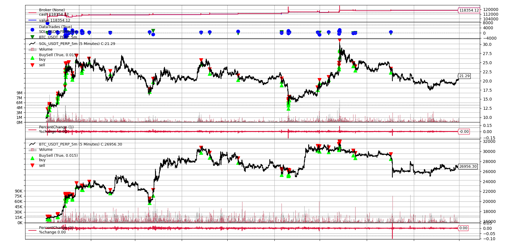

Simple backtesting framework.

Steps:
1. Run `data_gen.py` to populate the data folder
2. Run `backtest.py`. Currently, the strategy tested compares the % change of the price of each asset compared to the previous tick. If the % change differs by at least epsilon, short one asset and long the other, unless we are already holding the same position, in which case we do nothing. If we are currently holding some position and the % change is at most delta, close all positions.

Here is some results on SOL/BTC with data from 2023-01-01 to 2023-10-01 with $\epsilon=2$ and $\delta=1$
```
Starting Portfolio Value: 100000.00

Current year: 2023, Current month: 1
Current cash: 100000.0, Current value: 100000.0


Current year: 2023, Current month: 2
Current cash: 110420.53607909405, Current value: 110420.53607909405


Current year: 2023, Current month: 3
Current cash: 110526.27518687358, Current value: 110526.27518687358


Current year: 2023, Current month: 4
Current cash: 111101.32449466115, Current value: 111101.32449466115


Current year: 2023, Current month: 5
Current cash: 112003.25624265506, Current value: 112003.25624265506


Current year: 2023, Current month: 6
Current cash: 112880.45239461563, Current value: 112880.45239461563


Current year: 2023, Current month: 7
Current cash: 114959.64276630427, Current value: 114959.64276630427


Current year: 2023, Current month: 8
Current cash: 117882.48124010063, Current value: 117882.48124010063


Current year: 2023, Current month: 9
Current cash: 118354.12451453262, Current value: 118354.12451453262


Current year: 2023, Current month: 10
Current cash: 118354.12451453262, Current value: 118354.12451453262

Final Portfolio Value: 118354.12
Trading Pairs: ./data/SOL_USDT_PERP_5m.csv and ./data/BTC_USDT_PERP_5m.csv
From 2023-01-01 to 2023-10-01

Sharpe Ratio: OrderedDict([('sharperatio', 1.763292482708425)])

Annual Return: OrderedDict([(2023, 0.18354124514532622)])

Drawdown: AutoOrderedDict([('len', 22739), ('drawdown', 0.06416988667105758), ('moneydown', 75.9964744230092), ('max', AutoOrderedDict([('len', 27452), ('drawdown', 4.39955792407911), ('moneydown', 4907.986680012196)]))])

97 transactions were made.

Average profit per trade: 189.21777850033635 USD
```

Here is a plot:


I do not expect the performance to persist in production, since there is likely to be overfitting and all sorts of biases such as cherry picking. Minimal effort was put into the act of finding good alpha. Emphasis was on how to build a backtrading framework and how to evaluate a strategy.
